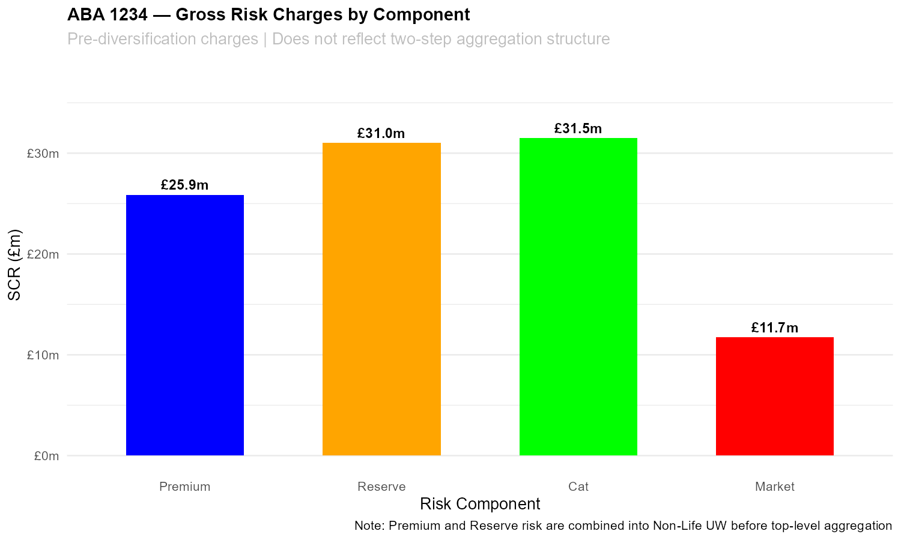
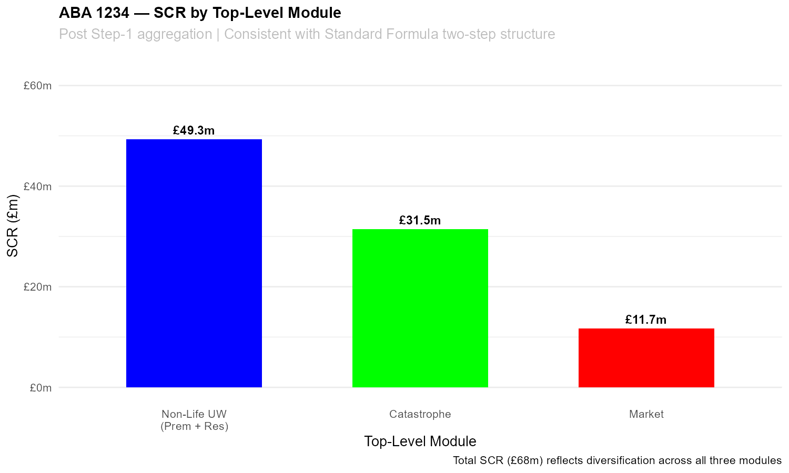
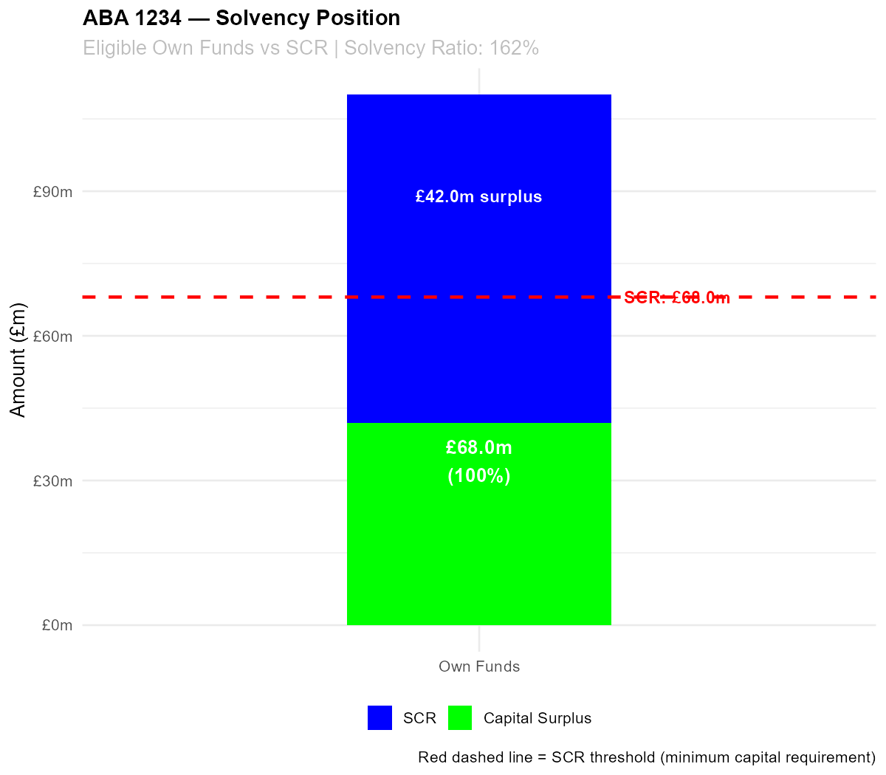
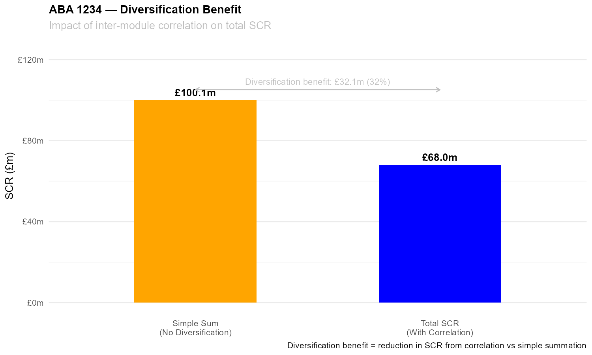

# Lloyd’s Syndicate Solvency II Capital Model
## Overview

This project is a simplified Solvency II-style capital model built in R for a hypothetical Lloyd’s syndicate (“ABA 1234”).

The model is designed to demonstrate understanding of:

- Non-life insurance risk modelling,
- Solvency II capital aggregation,
- Underwriting and market risk,
- Diversification effects,
- and Actuarial balance sheet mechanics.

The framework broadly follows the structure of the Solvency II Standard Formula while intentionally simplifying several components for transparency and educational purposes.


## Objectives

The project estimates:

- Premium Risk SCR
- Reserve Risk SCR
- Catastrophe Risk SCR
- Market Risk SCR

These risk modules are aggregated using a two-step Standard Formula structure, premium and reserve risk are first combined into a Non-Life Underwriting module, which is then aggregated with Catastrophe and Market risk via a top-level correlation matrix.

## The final outputs include:

- Total Solvency Capital Requirement (SCR)
- Diversification benefit
- Solvency ratio
- Risk visualisations
- Key Features
- Insurance Balance Sheet Construction
- Best estimate liabilities (BEL)
- Risk margin
- Technical provisions
- Own funds
- Underwriting Risk
- Premium risk
- Reserve risk
- Line-of-business correlations
- Catastrophe Risk
- Simplified Reference Damage Scenario (RDS) approach
- Reinsurance recoveries
- Market Risk
- Interest rate stress
- Equity stress
- Simplified ALM duration approach
- SCR Aggregation
- Quadratic correlation aggregation
- Diversification benefit analysis
- Visualisation
- SCR component analysis
- Solvency position
- Diversification impact

Example Outputs

- Gross Risk Charges by Component


- SCR by Top-Level Module


- Solvency Position


- Diversification Benefit


## Technologies Used

R
- ggplot2
- dplyr
- scales


## Simplifications and Limitations

This model is intentionally simplified and is not intended for regulatory or commercial use.

Key simplifications include:

- Simplified premium and reserve risk formulas
- Simplified catastrophe modelling
- Parallel interest-rate shocks
- No counterparty default risk
- No operational risk
- No lapse risk
- No stochastic simulation framework
- No full Standard Formula calibration

The project is intended as an educational and portfolio demonstration of actuarial modelling concepts.

## Potential Future Enhancements

Planned future developments may include:

- Monte Carlo simulation of reserve and premium risk distributions to replace the current closed-form stress approach
- Full loss triangle reserve risk modelling by line of business
- Spread risk and credit risk
- Reinsurance programme optimisation
- Economic scenario generation
- ORSA-style stress testing

## Motivation

I created this project to strengthen my understanding of:

- Lloyd’s market capital modelling,
- Solvency II structure,
- and actuarial risk aggregation techniques.

The project was also designed as part of my actuarial modelling portfolio while pursuing opportunities within the London Market / General Insurance sector.

## How to Run

### Run the model

```bash
Rscript solvency_ii_cap_model.R
```
